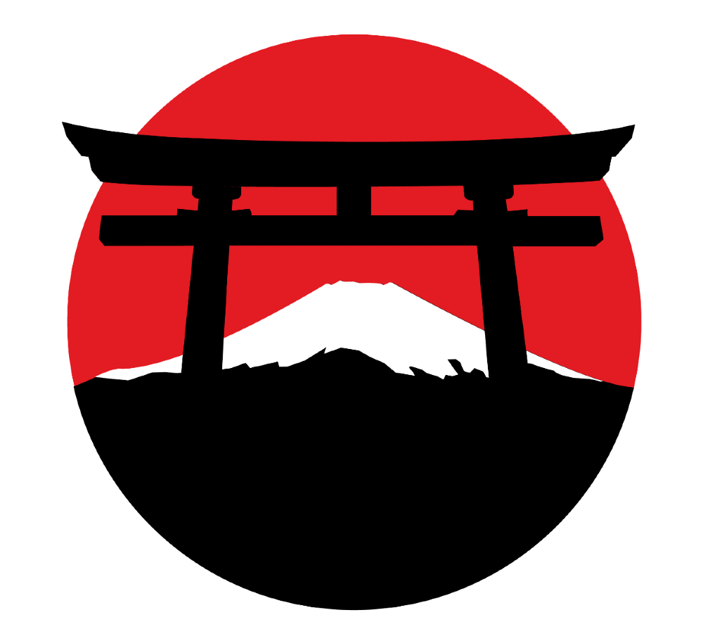

**
Everything you need to know about Japan
**

[View the live project here.](https://kroutm.github.io/Japan-s-Magic/)

## User Experience (UX)

-   ### User stories

    -   #### First Time Visitor Goals
    1. As a First Time Visitor, I want to immediately understand the intent of the site.
    2. As a First Time Visitor, I want to view and navigate the website on all devices.
    3. As a First Time Visitor, I want to have easy access to the websites pages.
    4. As a First Time Visitor, I want to know if it is reliable and professional.
    5. As a First Time Visitor, I want to have a good impression of the place, and feel supported.

    -   #### Returning Visitor Goals
    1. As a Returning Visitor, I want to be able to subscribe to receive communications or promotions.
    2. As a Returning Visitor, I would like to be able to send messages or reviews to improve the establishment.

    -   #### Frequent User Goals
    1. As a Frequent User, I want to have news added.
    2. As a Frequent User, I want to see improvements on the site but without changing the instinct, so it doesn't make me confused.
    3. As a Frequent User, I want to feel stability and constancy in the changes.

## Technologies used

### Languages Used

- [HTML5](https://en.wikipedia.org/wiki/HTML5)

- [CSS3](https://en.wikipedia.org/wiki/CSS)

### Frameworks Libraries and Programs

1. [Google Fonts](https://fonts.google.com/)
    - Google fonts were used to import the 'Cinzel Decorative' and 'Quicksand' fonts into the style.css file which is used on all pages throughout the project.
1. [Line Awesome](https://icons8.com/line-awesome)
    - I used the icons for decoration and social media links
1. [Github](https://github.com/)
    - Github was used to create and store the project repository.
1. [Visual Studio Code](https://code.visualstudio.com/)
    - Visual Studio Code was used to create my files and code the project.
1. [Am I responsive](http://ami.responsivedesign.is/)
    - Am I responsive was used to taking screenshots of the page at different screen sizes.
1. [BlueTree](https://bluetree.ai/screenfly/)
    - I used BlueTree to test the responsiveness and functionality of my website.
1. [Git](https://git-scm.com/)
    - Git was used for version control by utilizing the Gitpod terminal to commit to Git and Push to Github. 
1. [Unsplash](https://unsplash.com/)
    - Pictures that I used on the website.
1. [Coolors](https://coolors.co/)
    - To get the website colors.

-   ### Design
    -   #### Colour Scheme
        -   The colors used on this website were:
        

    -   #### Typography
        -   Quicksand was used for the titles and Cinzel Decorative was used for texts and descriptions.

    -   #### Imagery
        -   All the images used have great contrasts and subtly have the tones that were used on the site.

## Features
- The website is responsive on all device sizes.

    ### Home Page
    

    - ### Everything You Need To Know & Background Image
        
        

        - I wanted to put an inviting phrase that brings confidence to the user while expressing what the site is about, a site where people can get information about the place.

    - ### Place, Restaurants & Nightlife
        
        

        - This is the part where the user looks for information about his trip to Japan, to provide information on restaurants, bars, and tourist attractions.
        - When used on cell phones or tablets with 320px - 768px resolution, the images of Place, Restaurant, and Night Life is placed on top of each other, so the image and description are not too small to spoil the user experience in receiving the information.
        - The descriptions of the images appear only when the mouse is hovered over the images, so the user can feel the interaction with the site.

    - ### Culture
        
        

        - In this part of the site, I describe a little about the essence of Japanese culture and the user can also have more information when clicking on the link.
        - When the user's screen is smaller than 768px, the appearance in this part changes a little, the image before that was on the side of the description, becomes behind because there is no space to put it to the side, leaving the look strange and uncomfortable for the read.
        - Before, I had taken the image but I don't like it and I decided to improve it.

    - ### Best Time To Go
        
        

        - As the name says, in this part of the site the user must access the link and understand that each time of year has an advantage and will be guided to the available options of the time.
        - There's not much hype here, just three different stations splitting the space evenly on the screen for a prettier look, couldn't think of a better way to represent that.

    - ### About
        
        

        - The about section is a brief description of what the website is currently offering to the user.
        - It is possible to see the text when the user hover over it.
        - The user needs to acquire confidence, so in this part, I left a beautiful natural image of Japan, when the mouse hovers over the phrase "Who are us?", the user can read the description of us and what we are willing to offer.
        - To make this more readable on cell phones or tablets, I removed the margin of the .card so that it could take up more space on the screen.

    ### Contact Page
    

    - The user needs to acquire confidence, so in this part, I left a beautiful natural image of Japan, when the mouse hovers over the phrase "Who are us?", the user can read the description of us and what we are willing to offer.
    - To make this more readable on cell phones or tablets, I removed the margin of the .card so that it could take up more space on the screen.

    - ### Sign up & Send a Message
        
        

        - I wanted to put an inviting phrase that brings confidence to the user while expressing what the site is about, a site where people can get information about the place.
        - The entrance to the site is simple, delicate and all the elements in the navbar or phrases that needed to be placed are simple and transparent so as not to distract from the beauty that the image of the place brings.
        - The intention was for the user not to feel lost or frustrated with many elements on the screen.

    ## Navbar
    
    
    
    - The navbar is fixed at the top so that the user always has access to it even at the bottom of the page, so the user doesn't need to go back to the top of the page to access another page available in the navbar.
    - Simple and fully responsive.

    ## Footer
    
    

    - Contains the important information you need, such as contact information and help links.

## Testing
The W3C Markup Validator and W3C CSS Validator Services were used to validate every page of the project to ensure there were no syntax errors in the project.

- [Markup Validation Service](https://validator.w3.org/)
- [CSS Validation Service](https://jigsaw.w3.org/css-validator/)